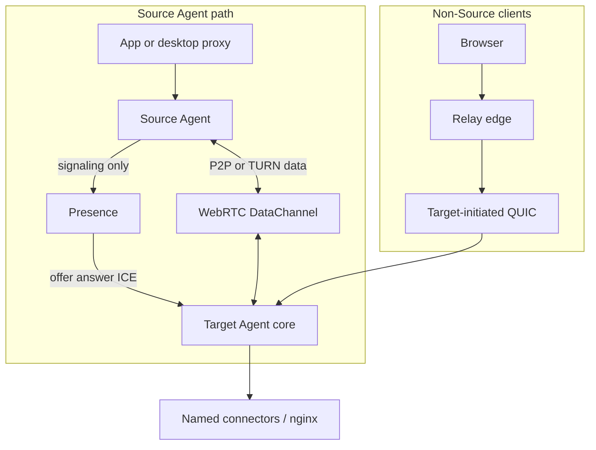

# Architecture gap analysis

**Date:** 2026-07-28  
**Maps:** donor `target-quic` + empty `agent` → target agent monorepo architecture  
**Related:** [current-implementation-assessment.md](./current-implementation-assessment.md), [migration-plan.md](./migration-plan.md)

---

## Target architecture (locked product rules)



| Rule | Meaning |
|------|---------|
| Source data plane | **WebRTC only** — never application HTTP/TLS through Relay |
| Signaling | **Presence only** for P2P sessions |
| Relay | Remains **Target/browser** option |
| Personal / enterprise TLS | **mTLS** — endpoint certs from entity CA-Root |
| Service provider TLS | **Custom domain + Let's Encrypt** on Target |
| `*.idr.to` Leg 2 (Relay↔Target) | **QUIC TLS to Relay identity** + token; HTTP to nginx `:80` (no nested TLS) |
| Source size | **Minimal, mobile-first**; proxies optional |

---

## Gap matrix

| Target capability | Current state | Gap | Smallest next step |
|-------------------|---------------|-----|--------------------|
| Agent monorepo | `agent` empty; Target in `target-quic` | Structural | Phase 1 port into Cargo workspace |
| Shared `idr-protocol` crate | Triplicated `src/protocol/` | Sync friction | Extract crate; keep presence/relay copies until they depend |
| Source Agent | Types only | Missing | Phase 3 minimal offerer |
| Source ↔ Target WebRTC | Target answerer only | No offerer / no SDK | Shared `idr-webrtc` + Source host |
| Source never uses Relay | N/A (no Source) | Must enforce | Crate boundary + CI dep check |
| PeerTransport abstraction | Concrete libdatachannel in Target | Coupled | Trait + adapter |
| Logical stream API | mux frames + ad-hoc bridge | No shared core API | `idr-core` sessions/streams |
| Flow control | Bounded peer event queue only | Missing windows/fairness | Phase 4 mux extension |
| Named Target services | nginx fixed ports + TcpConnect | Unrestricted risk / no names | Connector config map |
| HTTP/SOCKS Source proxies | Absent | Desktop gap only | Phase 5 optional crates |
| C ABI + Dart | Absent | Mobile embedding gap | Phase 5 after Source core |
| mTLS entity CA | Types / Presence roots reserved | Not end-to-end | `idr-auth` + Presence enforcement |
| LE custom domains | ACME on Target | Aligns for service providers | Retain; document |
| Leg 2 native `*.idr.to` | Implemented: Relay wildcard terminate → `HttpPassthrough` → nginx `:80` | Docs formerly mentioned self-signed | **Done** — ADR-0012 + security-model (QUIC only; no nested TLS) |
| No HTTPS MITM on Source | N/A | Keep as constraint | CONNECT byte relay only |
| Standalone Source service | Absent | Later | Thin host after embedded works |
| Admin IPC | Absent | Later | Named pipe / UDS |
| Melos / Flutter examples | Absent | Later | After FFI |
| Green build baseline | Compile errors on donor tree | Blocker | Fix before/during Phase 1 |

---

## What already matches (do not rewrite)

- Persistent WebRTC session + single reliable ordered DC mux (not PC-per-request).
- libdatachannel as WebRTC backend (`datachannel-rs` vendored).
- Presence-separated signaling for WebRTC.
- Target-initiated Relay QUIC for edge/browser path.
- Custom-domain LE on Target; Target holds those private keys.
- Postcard binary mux (efficient; not JSON bulk).
- Feature-gated WebRTC so Target can ship without native deps.

---

## Digressions from the long prompt (intentionally adjusted)

| Prompt idea | Adjustment |
|-------------|------------|
| Force full `idr-agents/` tree day one | Grow incrementally under `agent/` |
| Source may imply Relay HTTP | **Rejected** — WebRTC only for Source |
| Absolute E2E TLS always | Split: WebRTC app TLS E2E; Relay paths per TLS policy table |
| Replace stream_mux wholesale | **Extend** existing frames |
| Proxies + Melos first | **After** minimal mobile Source |
| Absorb Presence/Relay repos | **No** — protocol crate / sync only |

---

## Smallest reasonable change sequence

1. **Docs in `agent`** (this Phase 0) — done when these files land.
2. **Fix donor compile errors** (or port and fix) so workspace builds.
3. **Port Target → `agent` workspace** (`idr-protocol`, `idr-target`, `target-agent` bin).
4. **Introduce traits** (transport, stream, connector) around existing paths.
5. **Minimal Source** (Presence offer + WebRTC + open named stream) — no Relay dep.
6. **Extend mux + flow control**; sync protocol to presence/relay.
7. **C ABI + Dart** for mobile; optional desktop proxies.
8. **Deprecate `target-quic`** after explicit confirmation.

---

## Dependency graph (proposed)

```text
idr-protocol
    ↑
idr-webrtc (trait) ← idr-webrtc-libdatachannel
    ↑
idr-signaling (Presence discovery + JSON/QUIC client helpers)
    ↑
idr-core (sessions, streams, flow control, errors)
    ↑
    ├── idr-source          (NO relay/quic/acme)
    │     ↑
    │     ├── idr-c-api / Dart FFI
    │     ├── idr-proxy-* (optional)
    │     └── source-agent service (optional desktop)
    └── idr-target (+ connectors, relay, tunnel, acme)
          └── target-agent service
```

Presence and Relay remain external processes speaking `idr-protocol` wire formats.
